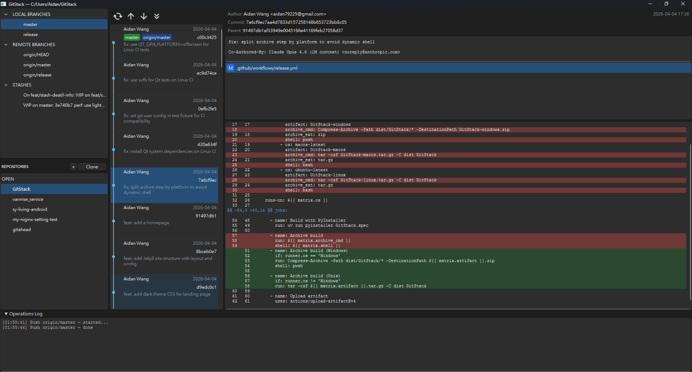

# GitCrisp

A desktop Git GUI client built with Python and PySide6 (Qt), designed for everyday Git workflows. GitCrisp provides a visual commit graph, per-hunk staging, multi-repository management, and streamlined remote operations — while deliberately leaving conflict-heavy operations to the CLI where they belong.

## Screenshot



## Features

### Commit Graph
- Visual lane-based graph showing branching and merging history
- Topological + time-sorted commit display with lazy pagination
- Click any commit to view its file list and unified diff
- Click a branch in the sidebar to scroll the graph to its HEAD and display commit details
- Dynamic page loading — automatically expands the loaded range to reach distant branches

### Staging & Committing
- File-level stage / unstage with checkbox toggles
- **Per-hunk staging** — stage or unstage individual diff hunks within a file
- Inline diff viewer with syntax-highlighted additions / deletions and line numbers
- Commit message editor with immediate feedback

### Branch Management
- Local and remote branch listing in a collapsible sidebar tree
- Create, delete, and checkout branches from the graph context menu
- Checkout remote branches (automatically creates local tracking branch)
- HEAD branch highlighted in the sidebar

### Stash
- One-click stash from the toolbar with confirmation dialog
- View stash contents (file list + diff) by clicking a stash in the sidebar
- Pop, apply, and drop stashes via context menu

### Remote Operations
- Push, pull, and fetch from the toolbar
- Fetch from a specific remote via sidebar context menu
- Fetch all with prune (`--all --prune`)
- Clone repositories via dialog
- All remote operations run in background threads with status logging

### Repository Management
- Multi-repo switcher with open and recent repository lists
- Persistent repo state stored in `~/.gitcrisp/repos.json`
- Open repositories from the file system or clone from URL

### Keyboard Shortcuts
| Key | Action |
|-----|--------|
| F5  | Reload |

## Architecture

GitCrisp follows **Clean Architecture** with strict layer separation:

```
git_gui/
├── domain/           # Entities (Commit, Branch, Stash, FileStatus, Hunk)
│                     # Protocols (IRepositoryReader, IRepositoryWriter, IRepoStore)
│
├── application/      # Use cases — one class per operation
│   ├── commands.py   # Write: stage, commit, checkout, push, stash, ...
│   └── queries.py    # Read: get_commits, get_branches, get_file_diff, ...
│
├── infrastructure/   # Adapters
│   ├── pygit2_repo.py   # Implements Reader & Writer via pygit2
│   ├── repo_store.py    # JSON-based repository persistence
│   └── git_clone.py     # Clone helper
│
└── presentation/     # Qt UI layer
    ├── main_window.py       # Signal orchestration between widgets
    ├── bus.py               # Command / Query bus (DI containers)
    ├── models/              # QAbstractTableModel / QAbstractListModel
    └── widgets/             # Graph, Sidebar, Diff, WorkingTree, etc.
```

**Key design decisions:**

- **Protocol-based dependency injection** — domain defines interfaces, infrastructure implements them, presentation consumes them through buses.
- **Signal-bridge pattern** — no widget-to-widget references. `MainWindow` wires all cross-widget communication via Qt signals.
- **Background threading** — remote operations and data loading run in worker threads; results are marshalled to the main thread via `QObject` signal bridges.

## Deliberately Omitted Features

Some Git operations are intentionally left out of GitCrisp. This is not a limitation — it is a design choice.

### Merge
Branch merging in a team workflow is best done through **pull requests** on platforms like GitHub or GitLab, where code review, CI checks, and approval gates provide a safer and more traceable process than a local merge button.

### Rebase & Cherry-Pick
These operations frequently involve **merge conflicts** that require manual resolution. No GUI can match the flexibility of a CLI paired with your preferred editor (Vim, VS Code, etc.) for resolving conflicts, editing rebase todo lists, or handling interactive rebases. Attempting to replicate this in a GUI would result in a worse experience than the tools developers already use.

## Requirements

- Python >= 3.13
- PySide6 >= 6.11.0
- pygit2 >= 1.19.2

## Getting Started

```bash
# Clone the repository
git clone https://github.com/Aidan79225/GitCrisp.git
cd GitCrisp

# Install dependencies (using uv)
uv sync

# Run the application
uv run python main.py
```

## Running Tests

```bash
uv run pytest -v
```

## License

MIT
